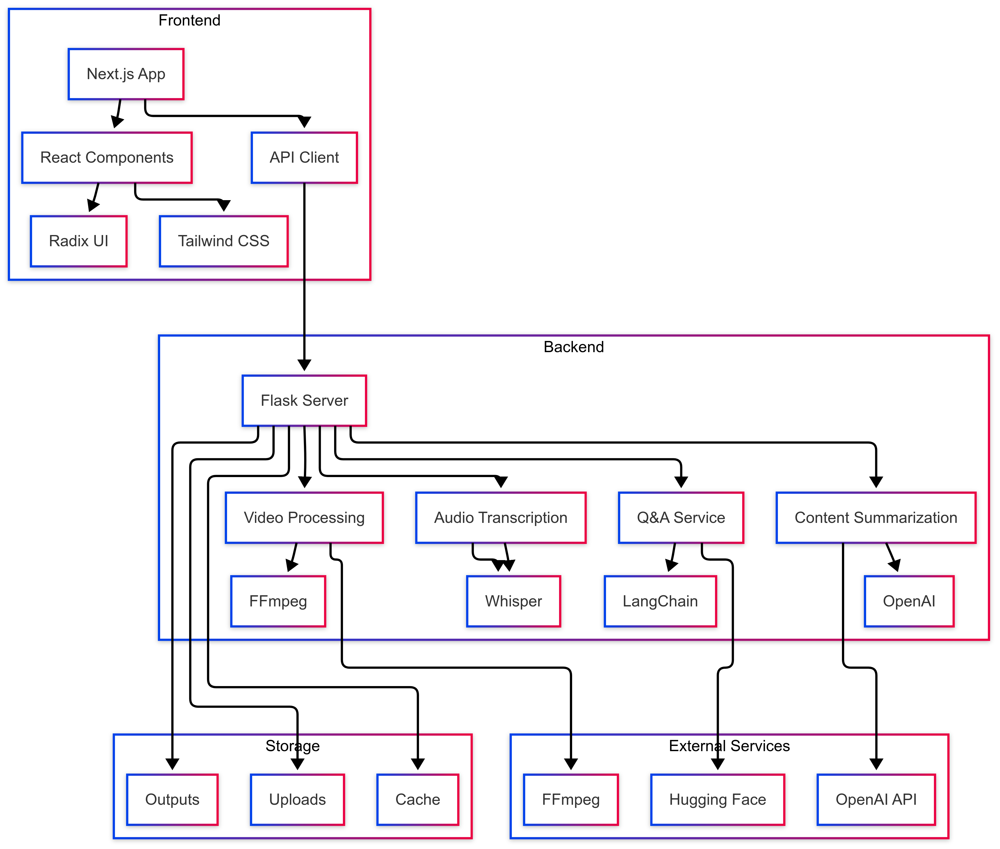

# Study Buddy - AI-Powered Learning Assistant

Study Buddy is an intelligent learning platform that helps students process and understand educational content through AI-powered features. The application can process video lectures, generate summaries, create study notes, and provide interactive Q&A capabilities.

## Demo Video

- [Watch the demo video here](./demo%20and%20screenshots/demo.mov)
- [View screenshots](./demo%20and%20screenshots/)
## Features

### Core Features
- **Video Processing**: Upload and process educational videos
- **Audio Transcription**: Automatic transcription of video content
- **Content Summarization**: AI-powered summarization of educational content
- **Smart Notes Generation**: Automatic generation of structured study notes
- **Interactive Q&A**: Chat-based interface for asking questions about the content
- **PDF Export**: Export generated notes and summaries as PDF files

### Technical Features
- **Modern Frontend**: Built with Next.js, React, and Tailwind CSS
- **AI Integration**: Leverages OpenAI and Hugging Face models
- **Real-time Processing**: Asynchronous video and audio processing
- **Caching System**: Efficient caching of processed content
- **Responsive Design**: Works across desktop and mobile devices

## System Architecture

The application is built with a modern microservices architecture:



### Frontend (Next.js)
- Built with Next.js 15.2.3
- React 19
- Tailwind CSS for styling
- Radix UI components
- TypeScript support

### Backend (Flask)
- Python 3.x
- Flask web framework
- OpenAI integration
- Hugging Face models
- FFmpeg for video processing
- Whisper for audio transcription

## Setup Instructions

### Prerequisites
- Node.js (v18 or higher)
- Python 3.8 or higher
- FFmpeg installed on your system
- OpenAI API key

### Backend Setup
1. Navigate to the backend directory:
   ```bash
   cd backend
   ```

2. Create and activate a virtual environment:
   ```bash
   python -m venv venv
   source venv/bin/activate  # On Windows: venv\Scripts\activate
   ```

3. Install dependencies:
   ```bash
   pip install -r requirements.txt
   ```

4. Set up environment variables:
   Create a `.env` file in the backend directory with:
   ```
   OPENAI_API_KEY=your_api_key_here
   ```

5. Start the backend server:
   ```bash
   python app.py
   ```

### Frontend Setup
1. Navigate to the frontend directory:
   ```bash
   cd frontend/study-buddy
   ```

2. Install dependencies:
   ```bash
   npm install
   ```

3. Start the development server:
   ```bash
   npm run dev
   ```

## API Endpoints

### Backend API
- `POST /upload`: Upload and process video files
- `GET /status/<filename>`: Check processing status
- `GET /uploads/<filename>`: Serve uploaded videos
- `POST /chat/process`: Process text for Q&A
- `POST /chat/ask`: Ask questions about processed content
- `POST /chat/delete`: Clear processed content

## Development

### Running Tests
```bash
# Backend tests
cd backend
python -m pytest

# Frontend tests
cd frontend/study-buddy
npm test
```

### Building for Production
```bash
# Frontend build
cd frontend/study-buddy
npm run build

# Backend deployment
cd backend
gunicorn app:app
```

# Authors
- [Akshay Chavan](https://www.linkedin.com/in/akshaychavan7/)
- [Ananya Asthana](https://www.linkedin.com/in/ananyaasthana/)
- [Gaurav Arun Tejwani](https://www.linkedin.com/in/gaurav-tejwani-758544270/)